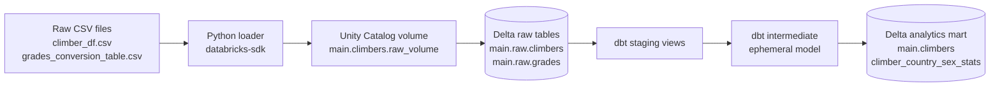
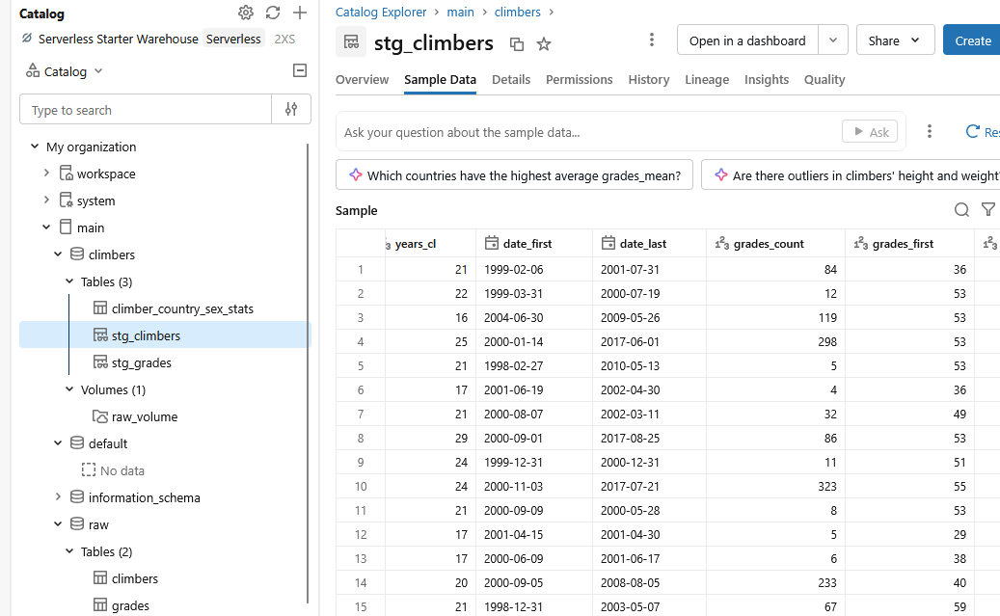
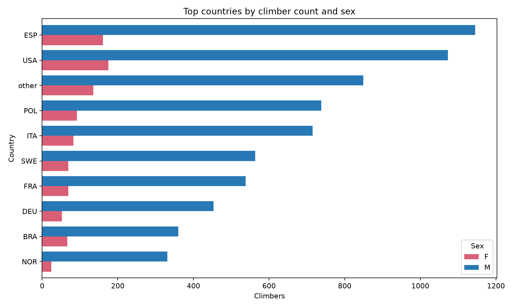
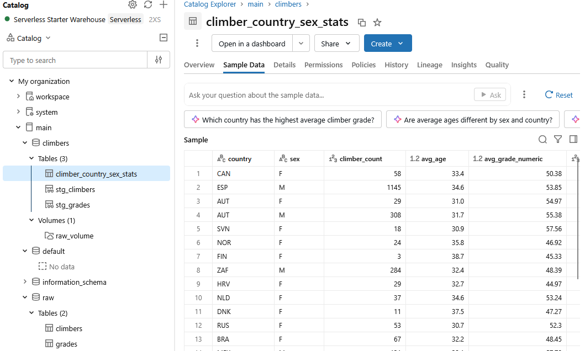

# Climbers Databricks dbt

A Databricks and dbt pipeline for the Kaggle [Climb Dataset](https://www.kaggle.com/datasets/jordizar/climb-dataset), based on the 8a.nu logbook. It loads two CSV files into Unity Catalog Delta tables and transforms them through raw, staging, intermediate, and marts layers into the `climber_country_sex_stats` analytics mart.

## Architecture



The pipeline's Delta tables as materialized by dbt, organized under `main.climbers` in Unity Catalog — raw, staging, and marts layers all visible in Catalog Explorer:



## Prerequisites

- Python 3.11 or later
- Access to a Databricks workspace with Unity Catalog and a SQL Warehouse
- A Databricks Personal Access Token with permission to create and query objects in the target catalog
- The source files `climber_df.csv` and `grades_conversion_table.csv`

## Quick Start

Create a virtual environment and install the loader dependency:

```powershell
python -m venv .venv
.\.venv\Scripts\Activate.ps1
python -m pip install dbt-databricks
python -m pip install -r requirements-dev.txt
```

Create `.env` from `.env.example` and set the Databricks connection values. Do not commit `.env`.

```powershell
Copy-Item .env.example .env
```

Load the variables into the current PowerShell process:

```powershell
Get-Content .env | ForEach-Object {
	if ($_ -match '^\s*([^#][^=]*)=(.*)$') {
		[Environment]::SetEnvironmentVariable(
			$matches[1].Trim(),
			$matches[2].Trim().Trim('"').Trim("'"),
			'Process'
		)
	}
}
```

Copy the dbt profile template, then upload the source CSV files and rebuild the raw Delta tables. Replace `<warehouse-id>` with the identifier at the end of `DATABRICKS_HTTP_PATH`.

```powershell
Copy-Item dbt\profiles.yml.example dbt\profiles.yml
.\.venv\Scripts\python.exe loaders\load_to_databricks.py --warehouse-id <warehouse-id>
```

Build and test the dbt project:

```powershell
dbt deps --project-dir dbt --profiles-dir dbt
dbt build --project-dir dbt --profiles-dir dbt
dbt test --project-dir dbt --profiles-dir dbt
```

## Data Model

The loader uploads both source files to `/Volumes/main/climbers/raw_volume` and creates these raw Delta tables:

- `main.raw.climbers`
- `main.raw.grades`

dbt materializes staging models as views, uses an ephemeral intermediate model, and materializes the final mart as a Delta table. `climber_country_sex_stats` contains one row per `country, sex` with:

- `climber_count`
- `avg_age`
- `avg_grade_numeric`
- `median_height`, calculated with Spark SQL `percentile_approx`
- `max_grade_numeric`
- `max_grade_label`
- `max_grade_climber_count`

The loader is idempotent: it overwrites the CSVs in the Unity Catalog volume and uses `CREATE OR REPLACE TABLE` for raw Delta tables. Re-running it does not append duplicate rows.

## Sample Output

The table below shows the top 10 groups by `climber_count` from a live run of the pipeline. The full result (54 rows, all countries and both sexes) is available in [`sample_output/climber_country_sex_stats.csv`](sample_output/climber_country_sex_stats.csv).

| Country | Sex | Climbers | Avg Age | Avg Grade (numeric) | Median Height (cm) | Max Grade | Climbers at Max Grade |
|---------|-----|---------:|--------:|---------------------:|--------------------:|-----------|----------------------:|
| ESP     | M   | 1,145    | 34.6    | 53.85                | 176                  | 9b        | 4                      |
| USA     | M   | 1,073    | 31.2    | 54.18                | 178                  | 9b        | 4                      |
| other   | M   | 849      | 32.8    | 55.59                | 178                  | 9b        | 1                      |
| POL     | M   | 738      | 32.5    | 53.83                | 179                  | 9b        | 2                      |
| ITA     | M   | 715      | 33.8    | 55.05                | 177                  | 9b        | 1                      |
| SWE     | M   | 563      | 37.5    | 49.27                | 180                  | 9a+       | 1                      |
| FRA     | M   | 538      | 33.0    | 57.46                | 177                  | 9b        | 1                      |
| DEU     | M   | 453      | 33.2    | 55.61                | 180                  | 9a+       | 2                      |
| BRA     | M   | 360      | 33.3    | 53.11                | 176                  | 9a+       | 1                      |
| NOR     | M   | 331      | 35.4    | 53.05                | 180                  | 9b        | 1                      |



The same result set, live in Databricks Unity Catalog:



Generated from a live pipeline run on <DATE>.

Generate or refresh both sample files manually after `dbt build`:

```powershell
.\.venv\Scripts\python.exe scripts\export_sample_output.py
```

Use `--limit <rows>` to export only the highest-ranked rows by `climber_count`. Without it, the script exports the full mart.

## Tests

dbt tests cover non-null and unique keys in staging, the relationship between transformed numeric grades and the grade conversion table, uniqueness of `country, sex` in the mart, and the valid range of `grade_id` values.

## CI and Orchestration

The GitHub Actions workflow is manually triggered from the Actions tab. It reads Databricks credentials from repository secrets and runs `dbt deps`, `dbt build`, and `dbt test`.

Two orchestration options are available:

- **GitHub Actions:** manually run the included workflow for repository-based validation and deployment checks.
- **Databricks Workflows (Jobs):** schedule the loader and dbt commands inside Databricks when the pipeline should be operated alongside the workspace data platform.

The project intentionally leaves the orchestration choice open.

## Why Databricks + dbt

This project reimplements the same pipeline from the original [Airflow/PostgreSQL/PySpark version](https://github.com/savlino/airflow_climbers_data) on the Databricks Lakehouse Platform to demonstrate an alternative modern data stack.

- **Unified batch + Spark workloads on one platform.** The original pipeline used a local PySpark job inside Airflow for the aggregation step. Databricks runs that same kind of Spark workload natively and at production scale, without hand-rolling a local Spark deployment.
- **Delta Lake as the storage layer.** Raw and transformed data are stored as Delta tables, giving ACID transactions, schema enforcement, and time travel -- useful properties for a warehouse layer that a plain CSV-in-Postgres setup does not provide.
- **dbt-databricks for transformation logic.** Moving the transformation logic (grade conversion, demographic joins, country/sex aggregations) out of imperative PySpark and into declarative, tested, version-controlled dbt models makes the lineage and business logic explicit and reviewable in SQL rather than buried in a Spark job.
- **Unity Catalog for governance.** Tables are organized under a proper catalog/schema hierarchy instead of a flat Postgres database, closer to how this would be structured in a real organization.
- **Portfolio purpose.** This repository intentionally reimplements the same source dataset and target output on a different stack to demonstrate the same data engineering problem solved with orchestration-light, warehouse-native tooling (Databricks + dbt) versus a container-orchestrated ETL approach (Airflow + Postgres + PySpark).

## Project Structure

```text
.
├── .github/workflows/ci.yml
├── dbt
│   ├── models
│   │   ├── intermediate
│   │   ├── marts
│   │   └── staging
│   ├── tests
│   ├── dbt_project.yml
│   └── profiles.yml.example
├── loaders
│   ├── databricks_sql.py
│   └── load_to_databricks.py
├── sample_output
│   ├── climber_country_sex_stats.csv
│   └── top_countries_by_climbers.png
├── scripts
│   └── export_sample_output.py
├── .env.example
├── requirements-dev.txt
└── README.md
```